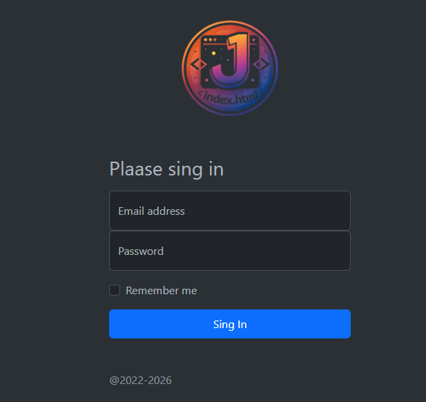

# 🔐 Login Page • HTML + Bootstrap

  

  
  
  

  🚀 Interface moderna | 🌙 Dark Theme | 📱 Responsivo

---

## ✨ Sobre o Projeto

Este projeto é uma **página de login moderna e responsiva**, desenvolvida com **HTML5** e **Bootstrap**, utilizando **tema escuro**, foco em **UX/UI** e organização visual.

Ideal para:
- Projetos acadêmicos  
- Sistemas web  
- Dashboards  
- Integração com APIs de autenticação  

---

## 🖼️ Preview da Interface

  

---

## 🚀 Tecnologias Utilizadas

| Tecnologia | Descrição |
|-----------|----------|
| 🧱 HTML5 | Estrutura da aplicação |
| 🎨 Bootstrap 5 | Layout, grid e componentes |
| 🌙 CSS | Estilização visual |
| ⚙️ JavaScript | Preparado para validações |

---

## 📂 Estrutura do Projeto
